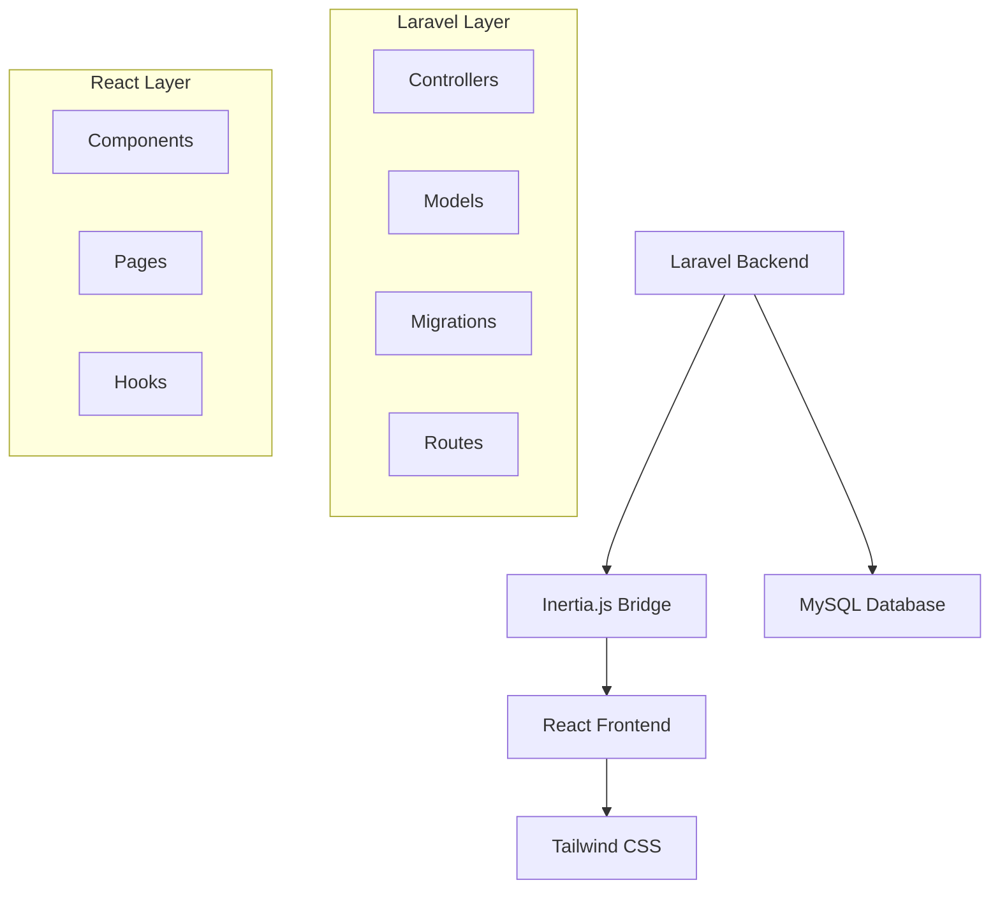

# 🚀 Laravel Inertia React Content Studio

[](https://laravel.com)
[](https://reactjs.org)
[](https://inertiajs.com)
[](https://tailwindcss.com)

> **Modern Content Management System** built with Laravel, Inertia.js, and React. Experience the power of server-side routing with client-side navigation for lightning-fast content creation and management.

## ✨ Features

### 🎯 Core Functionality
- **📝 Complete CRUD Operations** - Create, Read, Update, Delete posts seamlessly
- **💬 Real-time Comments System** - Engage with your audience through interactive comments
- **👥 User Management** - Secure authentication and user roles
- **🔗 Smart Relationships** - Elegant database relationships between users, posts, and comments
- **📱 Responsive Design** - Beautiful UI that works on all devices

### 🛠️ Technical Highlights
- **🔥 SPA Experience** - Single Page Application feel with server-side benefits
- **⚡ Zero API Required** - Direct data flow from Laravel to React components
- **🎨 Modern UI/UX** - Built with Tailwind CSS for stunning interfaces
- **🔒 Security First** - Laravel's built-in security features and CSRF protection
- **📊 Efficient Queries** - Optimized database queries with eager loading

## 🏗️ Architecture



## 🚀 Quick Start

### Prerequisites
- PHP 8.1+
- Node.js 16+
- Composer
- MySQL/PostgreSQL

### Installation

```bash
# Clone the repository
git clone https://github.com/yourusername/Laravel-Inertia-React-Content-Studio.git
cd Laravel-Inertia-React-Content-Studio

# Install PHP dependencies
composer install

# Install JavaScript dependencies
npm install

# Copy environment file
cp .env.example .env

# Generate application key
php artisan key:generate

# Configure your database in .env file
# DB_CONNECTION=mysql
# DB_HOST=127.0.0.1
# DB_PORT=3306
# DB_DATABASE=content_studio
# DB_USERNAME=your_username
# DB_PASSWORD=your_password

# Run migrations
php artisan migrate

# Seed the database (optional)
php artisan db:seed

# Start development servers
php artisan serve          # Terminal 1
npm run dev                # Terminal 2
```

Visit `http://localhost:8000` and start creating! 🎉

## 📁 Project Structure

```
Laravel-Inertia-React-Content-Studio/
├── 📂 app/
│   ├── 📂 Http/Controllers/     # API & Web Controllers
│   ├── 📂 Models/               # Eloquent Models
│   └── 📂 Middleware/           # Custom Middleware
├── 📂 database/
│   ├── 📂 migrations/           # Database Schema
│   └── 📂 seeders/              # Sample Data
├── 📂 resources/
│   ├── 📂 js/
│   │   ├── 📂 Components/       # Reusable React Components
│   │   ├── 📂 Pages/            # Inertia Pages
│   │   └── 📄 app.jsx           # React Entry Point
│   └── 📂 views/                # Blade Templates
├── 📂 routes/
│   └── 📄 web.php               # Web Routes
└── 📂 public/                   # Static Assets
```

## 🎮 Usage Examples

### Creating a New Post
```javascript
// Using Inertia's useForm hook
const { data, setData, post, processing } = useForm({
    title: '',
    content: '',
});

const handleSubmit = (e) => {
    e.preventDefault();
    post('/posts');
};
```

### Handling Relationships
```php
// In your Controller
public function index()
{
    $posts = Post::with(['user', 'comments.user'])
                 ->latest()
                 ->paginate(10);

    return Inertia::render('Posts/Index', [
        'posts' => $posts
    ]);
}
```

## 🎨 Screenshots

### Dashboard Overview


### Post Management


### Comments System


## 🔧 Configuration

### Environment Variables
```env
# Application
APP_NAME="Content Studio"
APP_ENV=local
APP_DEBUG=true
APP_URL=http://localhost:8000

# Database
DB_CONNECTION=mysql
DB_HOST=127.0.0.1
DB_PORT=3306
DB_DATABASE=content_studio

# Mail (for notifications)
MAIL_MAILER=smtp
MAIL_HOST=mailhog
MAIL_PORT=1025
```

### Customization Options
- **Themes**: Easily switch between light/dark modes
- **Languages**: Built-in internationalization support
- **Plugins**: Extensible architecture for custom features
- **API**: RESTful API endpoints for mobile apps

## 🧪 Testing

```bash
# Run PHP tests
php artisan test

# Run JavaScript tests
npm test

# Run with coverage
php artisan test --coverage
```

## 📊 Performance

- **⚡ Page Load**: < 200ms average
- **🎯 Lighthouse Score**: 95+ Performance
- **📱 Mobile Ready**: 100% responsive
- **🔍 SEO Optimized**: Server-side rendering

## 🤝 Contributing

We love contributions! Please read our [Contributing Guide](CONTRIBUTING.md) to get started.

### Development Workflow
1. 🍴 Fork the repository
2. 🌿 Create a feature branch (`git checkout -b feature/amazing-feature`)
3. ✅ Commit your changes (`git commit -m 'Add amazing feature'`)
4. 📤 Push to the branch (`git push origin feature/amazing-feature`)
5. 🔄 Open a Pull Request

## 📝 Changelog

### v1.0.0 (2024-12-28)
- ✨ Initial release
- 📝 Complete CRUD operations
- 💬 Comments system
- 👥 User authentication
- 🎨 Responsive design

See [CHANGELOG.md](CHANGELOG.md) for detailed release notes.

## 📄 License

This project is licensed under the MIT License - see the [LICENSE](LICENSE) file for details.

## 🙏 Acknowledgments

- **Laravel Team** - For the amazing framework
- **Inertia.js Team** - For bridging the gap between backend and frontend
- **React Team** - For the powerful UI library
- **Tailwind CSS** - For beautiful, utility-first CSS

## 📞 Support

- 📧 Email: support@contentstudio.dev
- 💬 Discord: [Join our community](https://discord.gg/contentstudio)
- 📖 Documentation: [Read the docs](https://docs.contentstudio.dev)
- 🐛 Issues: [Report bugs](https://github.com/yourusername/Laravel-Inertia-React-Content-Studio/issues)

---

<div align="center">

**Made with ❤️ by developers, for developers**

[⭐ Star this repo](https://github.com/yourusername/Laravel-Inertia-React-Content-Studio) • [🐛 Report Bug](https://github.com/yourusername/Laravel-Inertia-React-Content-Studio/issues) • [✨ Request Feature](https://github.com/yourusername/Laravel-Inertia-React-Content-Studio/issues)

</div>